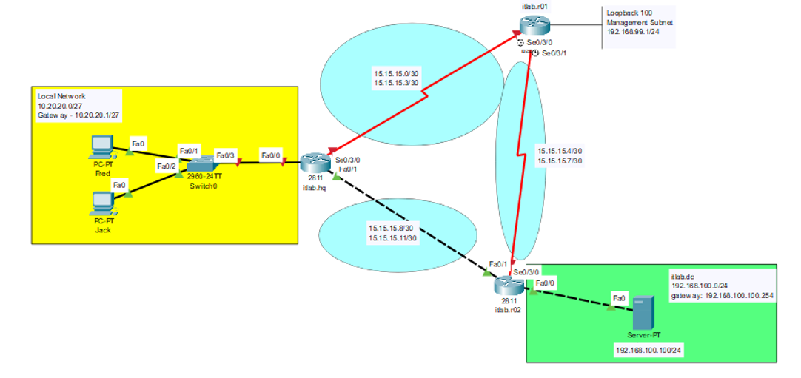
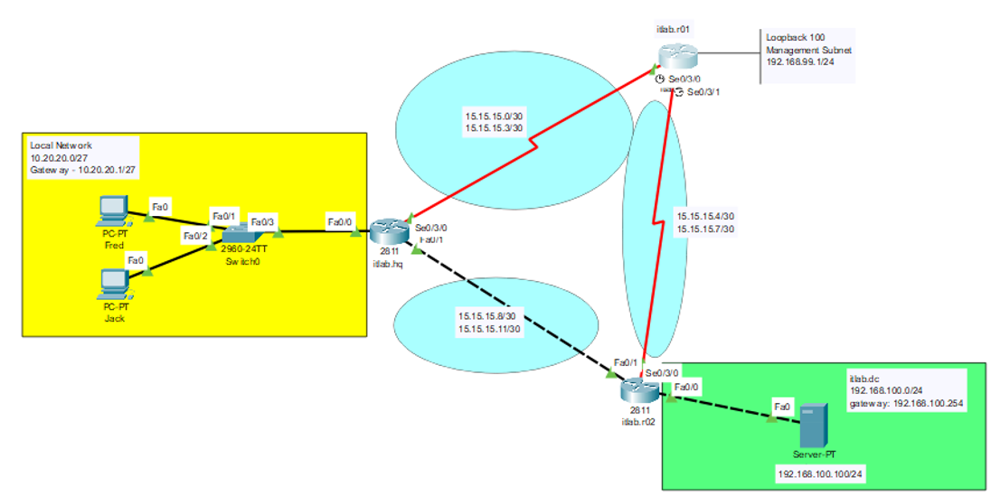

# Troubleshooting General Routing Configuration (Cisco Packet Tracer)

## Overview:
This project involved identifying and resolving misconfigurations in a simulated enterprise network using Cisco CLI commands only (no GUI). The scenario was provided as an assessment by our instructor and was designed to test real-world troubleshooting skills.

## Tools & Technologies Used:
- Cisco Packet Tracer (CLI only)
- Windows Command Prompt (ipconfig, ping)
- Cisco IOS commands (show ip interface brief, interface, ip address, show run, no shutdown, ping, etc.)

## Objectives:
Fix the broken network setup. Try to figure out the issues and fix them.
Hint: Use the show commands:
show run
show ip interface brief
ipconfig
ping
Investigative skills are needed on this one!

## Key Commands Used:
- show ip interface brief
- show run
- ip address
- no shutdown
- ipconfig
- ping

## Results:
- Investigated connectivity issues between PCs and routers; router and server.
- Identified incorrect IP address and subnet mask on router interface using show ip interface brief.
- Cross-checked server gateway with router configuration via ipconfig, show run, and show ip int brief.
- Used the show ip int brief to investigate down lines.
- Enabled down interfaces with no shutdown.
- Verified restored connectivity using ping.

## Notes: 
- Part of my CCNA simulation training        
- Supervised by a CCNP-certified instructor
